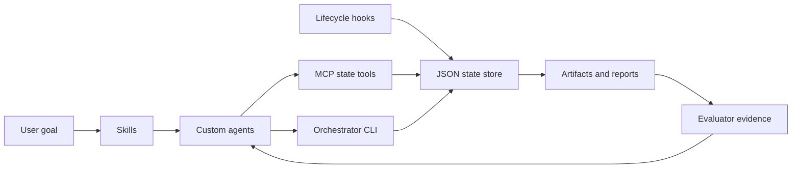

# codex-loop-plugin

`codex-loop-plugin` is a local Codex plugin prototype that turns a project goal into a file-backed PRD -> TaskGraph -> Dev -> Eval -> Repair -> Validation loop.

## Why Loop

Long Codex projects drift when the only source of truth is a chat thread. Context compacts, validation evidence gets scattered, and agents can lose the original acceptance criteria. Codex Loop keeps the work resumable by writing plans, decisions, schemas, state, artifacts, and validation evidence into the repository.

## Architecture



Core layers:

- Plugin layer: `.codex-plugin/plugin.json`, assets, `.mcp.json`, hooks pointer.
- Skill layer: `$codex-loop`, `$prd-planner`, `$task-decomposer`, `$dev-worker`, `$evaluator`, `$context-distiller`, `$integration-manager`.
- Agent layer: custom agent TOML files under `.codex/agents/`.
- MCP layer: local STDIO server exposing state-only tools.
- State Store layer: JSON-backed `LoopStore` under `state/*.json`.
- Orchestrator CLI layer: local state machine and commands.
- Hooks layer: lifecycle event scripts for evidence capture.
- Demo layer: `examples/demo-repo` and e2e proof.

See [docs/ARCHITECTURE.md](/Users/litmus/Downloads/codex-loop-plugin/docs/ARCHITECTURE.md).

## Quick Start

Install dependencies:

```bash
npm install
```

Validate the project:

```bash
npm run validate
```

Run the demo feature test:

```bash
npm test -- examples/demo-repo/tests/sample-feature.test.ts
```

Run the demo loop proof:

```bash
npm test -- tests/e2e/demo-loop.test.ts
```

If global `node` or `npm` is unavailable in this environment, use the bundled runtime path recorded in [docs/LOOP_PROGRESS.md](/Users/litmus/Downloads/codex-loop-plugin/docs/LOOP_PROGRESS.md).

## Module List

- M0 Project Memory and Scaffold: complete.
- M1 Core Schemas and Runtime Types: complete.
- M2 Plugin Manifest and Metadata: complete.
- M3 Loop Skills: complete.
- M4 Custom Agent Definitions: complete.
- M5 Local Loop State Store: complete.
- M6 MCP Loop Store Server: complete.
- M7 Orchestrator CLI: complete with runtime adapter stub.
- M8 Codex Hooks: complete with trust boundary.
- M9 Demo Fixture and E2E Loop: complete.
- M10 Documentation and Release Polish: complete after final validation.

## Current Capabilities

- JSON Schema contracts and TypeScript runtime validation for loop entities.
- Local JSON state store with schema-backed writes and event log.
- MCP state tools for LoopRun, AgentProfile, TaskNode, Artifact, EvalReport, RepairRequest, ContextCapsule, and events.
- Local CLI for `init`, `status`, `plan`, `run`, `eval`, `repair`, `capsule`, and `report`.
- Custom agent definitions with read/write sandbox boundaries.
- Codex workflow skills with explicit input/output contracts.
- Lifecycle hooks for session context, validation capture, compaction capsules, subagent output capture, and stop checks.
- Demo fixture proving NEEDS_REVISION -> RepairRequest -> PASS flow.

## Current Limits

- The project is not published.
- The CLI does not call a real Codex SDK runtime.
- `RuntimeAdapter` is a stub for future runtime integration.
- The demo is a fixture proof, not a real autonomous Codex thread.
- Evaluator reports are structured evidence, but they are not a substitute for running tests.
- Context capsules reduce context loss but cannot guarantee zero information loss.
- Hooks require user review/trust before execution.

## Demo

The demo lives in [examples/demo-repo](/Users/litmus/Downloads/codex-loop-plugin/examples/demo-repo). It implements:

```ts
validateProjectName(name: string)
```

The fixture includes PRD, acceptance criteria, TaskGraph, DevResult, NEEDS_REVISION EvalReport, RepairRequest, PASS EvalReport, ContextCapsule, and FinalDeliveryReport.

More detail: [docs/EXAMPLES.md](/Users/litmus/Downloads/codex-loop-plugin/docs/EXAMPLES.md).

## Safety

- Evaluator, planner, context distiller, test reviewer, and architecture reviewer are read-only agents.
- MCP tools never execute shell commands or access the network.
- Hooks do not auto-fix code, delete files, commit git changes, or run arbitrary commands.
- State files should not store secrets.
- `danger-full-access` should not be a default sandbox for agents.

See [docs/SECURITY_MODEL.md](/Users/litmus/Downloads/codex-loop-plugin/docs/SECURITY_MODEL.md) and [docs/PLUGIN_BOUNDARIES.md](/Users/litmus/Downloads/codex-loop-plugin/docs/PLUGIN_BOUNDARIES.md).

## Roadmap

- Replace `StubRuntimeAdapter` with a real Codex runtime integration after the API boundary is confirmed.
- Verify official plugin ingestion behavior for reserved `hooks` metadata.
- Add real project fixtures beyond the tiny demo.
- Add packaging/release automation only after user approval.
- Consider SQLite/Postgres store implementations behind the existing `LoopStore` interface.

## Docs

- [Installation](/Users/litmus/Downloads/codex-loop-plugin/docs/INSTALLATION.md)
- [Usage](/Users/litmus/Downloads/codex-loop-plugin/docs/USAGE.md)
- [Architecture](/Users/litmus/Downloads/codex-loop-plugin/docs/ARCHITECTURE.md)
- [MCP Tools](/Users/litmus/Downloads/codex-loop-plugin/docs/MCP_TOOLS.md)
- [Hooks](/Users/litmus/Downloads/codex-loop-plugin/docs/HOOKS.md)
- [Agents](/Users/litmus/Downloads/codex-loop-plugin/docs/AGENTS.md)
- [Skills](/Users/litmus/Downloads/codex-loop-plugin/docs/SKILLS.md)
- [Examples](/Users/litmus/Downloads/codex-loop-plugin/docs/EXAMPLES.md)
- [Troubleshooting](/Users/litmus/Downloads/codex-loop-plugin/docs/TROUBLESHOOTING.md)
- [Release Checklist](/Users/litmus/Downloads/codex-loop-plugin/docs/RELEASE_CHECKLIST.md)
