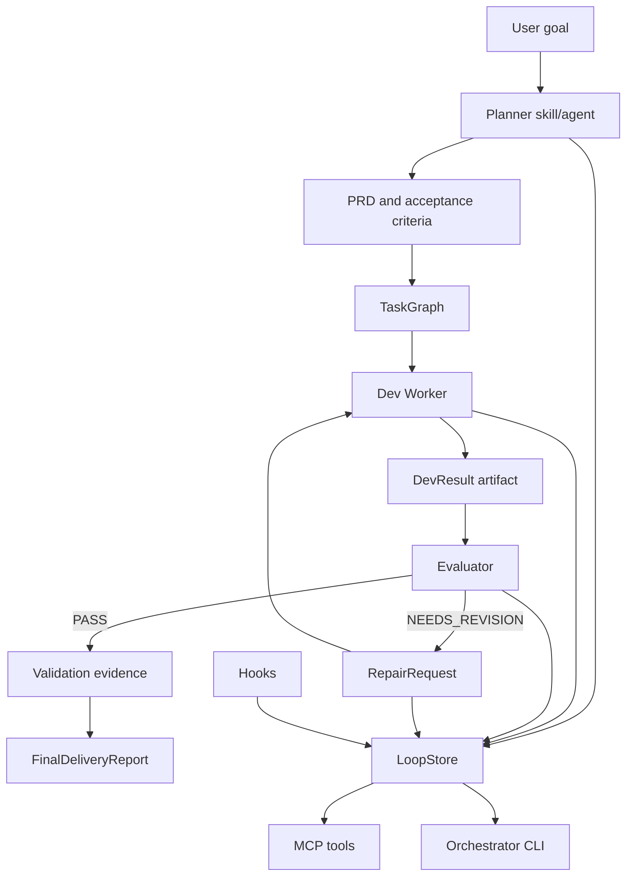
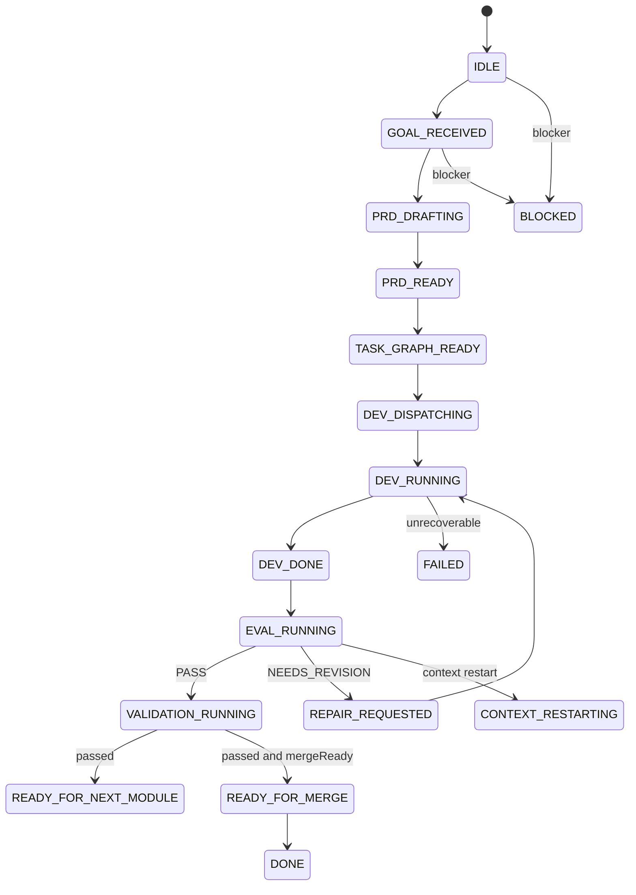

# Architecture

Codex Loop is organized as a local plugin package with explicit workflow, identity, state, automation, and demo layers.

## Plugin Layer

Files:

- `.codex-plugin/plugin.json`
- `.mcp.json`
- `assets/icon.svg`
- `assets/logo.svg`

The plugin manifest advertises skills, MCP server config, hooks, and display metadata. It does not publish the project or imply hooks are automatically trusted.

## Skill Layer

Files:

- `skills/codex-loop/SKILL.md`
- `skills/prd-planner/SKILL.md`
- `skills/task-decomposer/SKILL.md`
- `skills/dev-worker/SKILL.md`
- `skills/evaluator/SKILL.md`
- `skills/context-distiller/SKILL.md`
- `skills/integration-manager/SKILL.md`

Skills define how Codex should behave in each loop phase. They are workflow contracts, not durable state stores.

## Agent Layer

Files:

- `.codex/agents/*.toml`
- `.codex/config.toml`

Custom agents define role identity, sandbox boundaries, and output contracts. Read-only roles include planner, evaluator, context distiller, test reviewer, and architecture reviewer. Write-capable roles include dev worker and integration manager.

## MCP Layer

Files:

- `src/mcp/server.ts`
- `src/mcp/tools.ts`
- `src/mcp/tool-schemas.ts`
- `src/mcp/tool-results.ts`

The MCP server exposes the local state store as state-only tools. Tools do not execute shell commands, access the network, or edit source files.

## State Store Layer

Files:

- `src/state/types.ts`
- `src/state/json-store.ts`
- `src/state/json-file.ts`
- `state/*.json` at runtime

`LoopStore` is the durable local fact source. JSON writes use temp-file then rename. Schema-backed entities use M1 runtime validation before persistence.

## Orchestrator CLI Layer

Files:

- `src/orchestrator/*`
- `src/cli/index.ts`
- `src/cli/commands/*`

The CLI provides local commands for init, status, plan, run, eval, repair, capsule, and report. It advances one state-machine step at a time. Real Codex runtime execution is intentionally stubbed behind `RuntimeAdapter`.

## Hooks Layer

Files:

- `hooks/hooks.json`
- `hooks/*.ts`
- `src/hooks/*`

Hooks capture lifecycle evidence and write bounded state/artifacts. They require user trust before execution.

## Demo Layer

Files:

- `examples/demo-repo/*`
- `tests/e2e/demo-loop.test.ts`

The demo proves the local schemas, state store, EvaluationGate, ContextManager, and ReportBuilder can run a small repair loop.

## Data Flow

## State Machine

