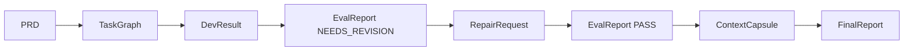

# Examples

## Demo Repo

The M9 demo fixture lives in [examples/demo-repo/](/Users/litmus/Downloads/codex-loop-plugin/examples/demo-repo).

It demonstrates a small project-name validation feature:

```ts
validateProjectName(name: string)
```

The validation rules are:

- Empty string fails.
- Whitespace-only string fails.
- Names longer than 80 characters fail.
- Normal names pass.

## Demo Evidence

The demo repo includes:

- `docs/PRD.md`: user wants to create a project and validate project names.
- `docs/TASK_GRAPH.json`: contains `TASK-001` for implementation and `TASK-002` for tests/docs.
- `artifacts/eval-report-needs-revision.json`: simulates missing whitespace-only test coverage.
- `artifacts/repair-request.json`: scopes repair to the test gap and forbids UI/database expansion.
- `artifacts/eval-report-pass.json`: records PASS after validation evidence.
- `artifacts/FinalDeliveryReport.md`: summarizes the demo delivery.

File list:

- `docs/PRD.md`
- `docs/ACCEPTANCE_CRITERIA.md`
- `docs/TASK_GRAPH.json`
- `artifacts/dev-result.json`
- `artifacts/eval-report-needs-revision.json`
- `artifacts/repair-request.json`
- `artifacts/eval-report-pass.json`
- `artifacts/context-capsule.json`
- `artifacts/FinalDeliveryReport.md`

## Run Demo Tests

Run the feature test:

```bash
npm test -- examples/demo-repo/tests/sample-feature.test.ts
```

Run the e2e loop proof:

```bash
npm test -- tests/e2e/demo-loop.test.ts
```

Run all project validation:

```bash
npm run validate
```

## Boundary

The demo proves the local schemas, state store, evaluation gate, context capsule writing, and final report generation work together. It does not start a real Codex thread, access the network, add a frontend framework, or implement a database.

## Flow


