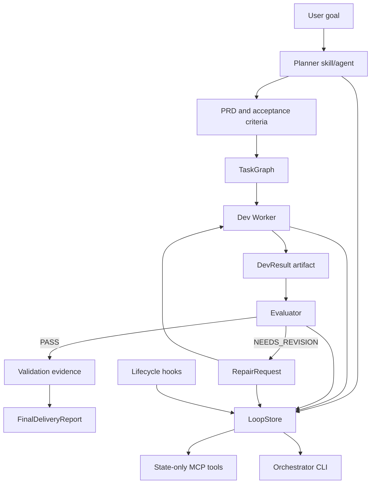

# Codex Loop: 面向 LLM 编程代理的证据门控式可恢复工程编排框架

> Draft status: working paper draft for later polishing.
> Intended use: feed this draft to a stronger writing model, then rewrite into a technical blog, tool demo paper, NIER paper, or empirical software engineering manuscript.
> Evidence basis: current repository files as of 2026-06-24, especially `README.md`, `docs/ARCHITECTURE.md`, `docs/GATE6B_SDK_ORCHESTRATED_VALIDATION.md`, `docs/M12_EFFECTIVENESS_EVALUATION.md`, `docs/M12_RELEASE_GATES.md`, `docs/LOOP_PROGRESS.md`, and the implementation files under `src/orchestrator`, `src/effectiveness`, `src/runtime`, and `evals/effectiveness`.

## 拟定题目

Codex Loop: An Evidence-Gated and Checkpointed Harness for Reliable LLM Coding Agent Workflows

中文题目可写为：

Codex Loop：面向大语言模型编程代理的证据门控与检查点式工程编排框架

## 摘要草稿

大语言模型编程代理正在从单轮代码生成工具发展为能够规划、修改、验证和修复软件项目的长程工程代理。然而，现有实践常常依赖单一对话上下文或一个端到端提示来驱动代理执行，导致需求漂移、验证证据分散、失败难以归因、上下文压缩后难以恢复，以及代理对自身完成状态的过度声明。本文提出 Codex Loop，一个面向 LLM 编程代理的本地插件与实验编排框架。该框架将用户目标显式转化为文件化 PRD、验收标准、任务图、开发结果、评估报告、修复请求、上下文胶囊和最终交付报告，并通过 SDK-Orchestrated Mode 将 Planner、Dev Worker、Evaluator、Repair Dev Worker 和 Final Evaluator 拆分为可检查的阶段。Codex Loop 的核心机制是证据门控状态机：每个阶段只有在产生线程 ID、结构化 artifact、验证日志和必要 verdict 后才能进入下一阶段；失败会被分类为具体的启动、输出契约、超时、验证、证据陈旧或安全问题，而不是被折叠为笼统的 agent failure。为了评估该框架，项目实现了 M12-mini baseline-vs-treatment harness：baseline 使用普通 Codex 执行，treatment 使用 SDK-Orchestrated Codex Loop，并通过 task-success、validation-pass、diff-scope、artifact-completeness、evaluator-false-pass、repair-convergence、security 和 cost-latency 等 grader 进行复评分。当前证据显示，Gate 6B.2 已完成完整的 repair-loop E2E 证明，`repair-loop-001`、`feature-small-001` 和 `bugfix-small-001` 三个 selected canary 已产生 baseline 与 treatment 真实运行 PASS 证据；`test-coverage-001` 已达到 fixture、runner 和静态 readiness，但尚未执行真实 canary。本文讨论 Codex Loop 的架构、harness 编排创新、工程化贡献、初步实验结果、局限性与未来研究方向，并分析其作为技术博客、工具演示论文、NIER 论文或经验软件工程论文的投稿路径。

## 关键词

LLM coding agents, software engineering harness, evidence-gated workflow, checkpointed orchestration, repair loop, agent evaluation, reproducibility, Codex, MCP, JSON Schema

## 1. 引言草稿

大语言模型已经可以在真实代码仓库中执行修改、运行测试、读取错误并继续修复。与传统代码补全相比，LLM 编程代理面临的是一个更复杂的软件工程问题：它们需要理解需求、规划任务、修改代码、运行验证、根据评审反馈修复，并在长上下文和多阶段执行中保持一致性。当前许多 agentic coding workflow 仍然依赖一个长 prompt 或一个长对话线程作为主要状态载体。这种方式在小任务中可用，但在长程工程工作中暴露出明显问题。

首先，对话上下文不是稳定的工程事实来源。随着任务变长，线程可能压缩，验证证据散落在日志和口头总结中，后续代理难以知道哪些需求已经实现、哪些测试确实通过、哪些问题被明确推迟。其次，端到端 agent 运行缺少可解释的阶段边界。当一次自动化运行失败时，失败可能来自模型输出格式、SDK 启动、工具调用超时、权限配置、验证命令、评估误判或安全策略，但普通脚本往往只留下一个失败状态。第三，LLM agent 容易过度声明完成，尤其是在没有强制 artifact、thread id、validation log 和 evaluator verdict 的情况下。

Codex Loop 的出发点是把 LLM 编程代理从“对话驱动”改造成“证据驱动”。它不是提出新的语言模型算法，而是提出一个软件工程 harness：每一步工程行为都必须写入本地文件、状态库或报告，并由状态机要求足够证据后才能进入下一阶段。框架将用户目标转化为 PRD、TaskGraph、DevResult、EvalReport、RepairRequest、ContextCapsule 和 FinalDeliveryReport，并使用 SDK-Orchestrated Mode 将长程工作拆成可恢复的线程阶段。

本文的核心论点是：LLM 编程代理的可靠性不仅取决于模型能力，还取决于围绕模型的工程编排机制。一个成熟的 agentic software engineering system 应当具备可恢复状态、明确角色边界、证据门控、失败归因、安全边界和可复评分实验数据。Codex Loop 是对这一方向的一个原型实现。

## 2. 问题定义

本文关注的问题可以表述为：

给定一个需要 LLM 编程代理在真实仓库中完成的工程目标，如何设计一个本地、可审计、可恢复、可复评分的多阶段编排框架，使其能够：

- 保留需求、计划、修改、评估、修复和验证证据；
- 防止 agent 在缺少验证证据时声明完成；
- 在失败时定位具体失败阶段和失败类别；
- 支持 baseline 与 treatment 的可比实验；
- 在上下文压缩、执行中断或局部失败后继续恢复；
- 避免将安全风险、权限越界和 prompt injection 混入普通功能失败。

## 3. 系统概览

Codex Loop 是一个本地 Codex plugin prototype。它将用户目标转化为文件化的 `PRD -> TaskGraph -> Dev -> Eval -> Repair -> Validation` 循环。项目 README 将其定义为一个 file-backed loop：长期 Codex 项目会因为只依赖聊天线程而发生漂移，Codex Loop 则把计划、决策、schema、state、artifact 和验证证据写入仓库。

系统由以下层组成：

- Plugin layer: `.codex-plugin/plugin.json`、`.mcp.json`、图标和展示元数据。
- Skill layer: `$codex-loop`、`$prd-planner`、`$task-decomposer`、`$dev-worker`、`$evaluator`、`$context-distiller`、`$integration-manager` 等 workflow contracts。
- Agent layer: `.codex/agents/*.toml` 定义 planner、dev worker、evaluator、context distiller、integration manager 等角色及 sandbox 边界。
- MCP layer: 本地 STDIO MCP server，将 LoopStore 暴露为 state-only tools。
- State Store layer: JSON-backed LoopStore，使用 schema-backed writes 和事件日志。
- Orchestrator CLI layer: 本地状态机、evaluation gate、repair dispatcher、report builder 和 runtime adapter。
- Hooks layer: 生命周期 hook，用于 session context、validation capture、pre-compact capsule、subagent output 和 stop hints。
- Demo and evaluation layer: `examples/demo-repo`、Gate 5/Gate 6/Gate 6B、M12 effectiveness harness。

架构可概括为：



## 4. 核心技术创新

### 4.1 文件化工程记忆

Codex Loop 不把聊天记录作为唯一事实来源。它要求关键工程状态写入仓库：

- `docs/PRD.md`
- `docs/ACCEPTANCE_CRITERIA.md`
- `docs/TASK_GRAPH.json`
- `artifacts/dev-result.json`
- `artifacts/eval-report*.json`
- `artifacts/repair-request.json`
- `artifacts/FinalDeliveryReport.md`
- `state/*.json`
- `evals/**/reports/*.json`

这种文件化工程记忆有两个作用。第一，它使后续 agent 可以从当前 worktree 恢复，而不是依赖上一个对话窗口。第二，它使人工审查者可以检查真实 artifact、diff、日志和 verdict，而不是只相信 agent 的自然语言总结。

### 4.2 契约优先的 agent 工作流

系统把 workflow contract 分布在三个层次：

- Skills 描述每个阶段的行为约束；
- Agent TOML 描述角色、权限和输出边界；
- JSON Schema 和 TypeScript validators 描述 LoopRun、TaskGraph、TaskNode、EvalReport、RepairRequest、ContextCapsule 等数据契约。

这种设计避免把复杂工作流完全压进 prompt。Prompt 仍然重要，但它不是唯一约束。状态机、schema、runtime validation 和 grader 共同形成约束系统。

### 4.3 证据门控状态机

Codex Loop 的 SDK loop state machine 要求每个 transition 必须携带证据。例如，从 `VERIFY_PLANNER_ARTIFACTS` 到 `RUN_DEV_WORKER_THREAD` 需要 `planner_thread_id`、`prd_artifact` 和 `task_graph_artifact`；从 `VERIFY_INITIAL_EVAL` 到 `CREATE_REPAIR_REQUEST` 要求 initial evaluator verdict 为 `NEEDS_REVISION`；从 `VERIFY_FINAL_EVAL_PASS` 到 `RUN_FINAL_VALIDATION` 要求 final evaluator verdict 为 `PASS`；进入 `DONE` 还要求 `tests_passed=true`。

这使系统不会因为 agent 自称完成而前进。只有 artifact、thread id、verdict 和验证结果满足要求，状态才推进。该机制是 Codex Loop 与普通顺序脚本的关键差异。

### 4.4 Checkpointed SDK-Orchestrated Mode

Native Subagent Mode 在 Gate 6 中暴露出 dispatch-chain 不稳定：可以观察到 native `spawn_agent` 和部分 planner/evaluator evidence，但完整链路没有可靠完成。项目因此将 SDK-Orchestrated Mode 作为主要 production-path candidate。

Gate 6B.2 将完整 repair loop 拆成明确 checkpoint：

```text
Planner -> Initial Dev Worker seeded gap -> Initial Evaluator NEEDS_REVISION
-> RepairRequest -> Repair Dev Worker -> Final Evaluator PASS -> FinalDeliveryReport
```

每个阶段写入 checkpoint state。该设计允许：

- 单独验证 planner 输出；
- 单独验证 dev worker 是否产生真实文件修改；
- 单独验证 evaluator 是否捕获已知缺陷；
- 单独生成 RepairRequest；
- 单独验证 repair worker 是否修复并通过测试；
- 单独验证 final evaluator 是否给出 PASS；
- 在任何失败点保留局部证据并停止。

### 4.5 Seeded-gap evaluator test

Gate 6B.2 的 seeded-gap 设计是一个较强的 harness 创新。初始 Dev Worker 被要求只实现 baseline acceptance：

- reject empty string；
- reject names longer than 80 characters；
- accept valid names；
- intentionally preserve whitespace-only gap。

因此初始实现必须通过 `npm run test:baseline`，但必须让 `npm run test:full` 失败。随后 Initial Evaluator 只有在 `known_gap_seeded=true`、baseline tests pass 且 full tests fail 后才能运行。如果 evaluator 返回 `PASS`，harness 会将其分类为 `INITIAL_EVALUATOR_DID_NOT_CATCH_SEEDED_GAP`。

这相当于给 evaluator 注入一个可验证的已知缺陷，用来测试 evaluator 是否真正阅读 acceptance criteria、测试证据和代码行为，而不是机械地认可 dev worker 输出。

### 4.6 轻量输出契约与后处理验证

项目曾遇到 planner output contract 问题：v1 `task_graph_json` 使用嵌套 JSON 字符串，导致 escaping 问题，planner thread 已经存在但 post-processing 失败。M12.1F 引入 planner-lite-v2：让模型直接输出结构化 `tasks[]`，避免嵌套 JSON 字符串；orchestrator 再 hydrate canonical `docs/TASK_GRAPH.json`，并通过 schema validation 检查最终 artifact。

这一模式可总结为 lightweight model-facing schema + strict orchestrator-side hydration。其意义在于：不要强迫 LLM 一次输出完整复杂 schema；让模型输出较稳定的中间结构，再由确定性代码完成规范化、补全和校验。

### 4.7 Baseline-vs-treatment effectiveness harness

M12 将 evaluation 设计为 baseline 与 treatment 对照：

- Baseline: plain Codex prompt，没有强制 PRD、EvalReport、RepairRequest 或 FinalReport。
- Treatment: SDK-Orchestrated Codex Loop，必须记录 thread ids、artifacts、EvalReport、RepairRequest 和 FinalReport。

M12-mini 数据集包含 10 类 case，包括 feature、bugfix、test coverage、docs update、refactor、repair loop 和 adversarial prompt injection。每个 case 声明 fixture repo、prompt、treatment goal、acceptance criteria、validation commands、expected artifacts、forbidden files、risk level 和 graders。

### 4.8 多维 grader 体系

M12 不只看测试是否通过，而是使用多个 grader：

- `task-success`: 检查 acceptance criteria evidence；
- `validation-pass`: 检查验证命令日志；
- `diff-scope`: 阻止 forbidden file changes；
- `artifact-completeness`: 检查 required artifacts；
- `evaluator-false-pass`: 检测与失败证据冲突的 PASS verdict；
- `repair-convergence`: 检查 `NEEDS_REVISION -> RepairRequest -> repair -> PASS` 收敛；
- `security`: 检查 secret leaks、dangerous commands 和 prompt injection；
- `cost-latency`: 记录 duration、thread count 和 command count。

这使 Codex Loop 的 evaluation 不只是“测试绿了”，而是更接近软件工程交付质量评估。

### 4.9 失败分类作为一等产物

Codex Loop 把失败分类为结构化类别，例如：

- planner post-processing failure；
- `PLANNER_TASK_GRAPH_JSON_INVALID`；
- `PLANNER_V2_TASKS_EMPTY`；
- `FEATURE_TREATMENT_PLANNER_NO_EVENT_TIMEOUT`；
- `FEATURE_TREATMENT_EVALUATOR_TURN_NO_EVENT_TIMEOUT`；
- `BASELINE_CODEX_EXEC_TIMEOUT`；
- `BASELINE_CODEX_NO_EVENT_TIMEOUT`；
- `CODEX_MODEL_CATALOG_REFRESH_FAILED`；
- `CODEX_LOCAL_STATE_DB_READONLY`；
- stale checkpoint；
- dry-run evidence overwrite；
- evaluator false pass。

这种分类使 failure analysis 可以成为论文和工程文档的一部分。它也防止 downstream report 把 planner failure 错报成 missing FinalReport，或把 evaluator timeout 错报成 planner timeout。

### 4.10 Smoke-slice 与 parity-slice 调试策略

当 generic feature treatment 出现 planner 或 evaluator timeout 时，项目没有直接重复整条 treatment run，而是引入 slice：

Planner-only smoke modes:

- parity: 无 outputSchema，仅测试最小响应；
- lite-minimal: 使用 planner-lite-v2 outputSchema 和极小任务；
- exact: 使用当前 concise feature planner prompt 和 planner-lite-v2。

Evaluator-only smoke modes:

- parity；
- text-only；
- output-minimal；
- output-lite；
- exact。

这种 slice 能定位问题来自 prompt、output schema、SDK adapter、event stream、模型、目标 repo、sandbox 还是 runtime。它是面向 LLM agent harness 的重要工程化调试方法。

### 4.11 超时与悬挂处理工程化

Baseline `codex exec` 曾经可能挂住。项目将 unbounded `spawnSync` 改为有预算的 `spawn`：

- 总 timeout；
- no-event timeout；
- stdout/stderr 增量写入；
- JSONL events 增量提取；
- invocation trace 在启动前写入；
- timeout 生成真实 `baseline-result.json`，而不是留下缺失结果。

该机制使 timeout 成为可评分结果，而不是实验系统的悬空状态。对于 LLM agent evaluation，这是非常关键的工程特性。

### 4.12 证据新鲜度与陈旧状态防护

M12 引入 regrade-only、`--fresh`、stale checkpoint protection、evidence freshness check 和 dry-run 不覆盖真实 evidence 等规则。后续 regrader 会从最新 treatment target repo 读取 `treatment-result.json`、FinalDeliveryReport、final EvalReport、validation log、diff、source file 和 test file，并列出被忽略的 stale triage files。

这使实验不会被旧的 blocked triage 覆盖新的 PASS evidence，也不会被 dry-run placeholder 覆盖真实运行结果。

## 5. 系统实现细节

### 5.1 数据模型

核心实体包括：

- LoopRun: 一次 loop 的运行实例；
- AgentProfile: agent 角色与配置；
- TaskGraph/TaskNode: 需求拆分后的任务图；
- Artifact: PRD、TaskGraph、DevResult、EvalReport 等产物引用；
- EvalReport: evaluator 输出，包含 PASS 或 NEEDS_REVISION；
- RepairRequest: 从 EvalReport findings 生成的修复请求；
- ContextCapsule: 上下文压缩或恢复时的事实摘要；
- SDK ThreadRun: SDK-Orchestrated Mode 的线程证据。

这些实体通过 JSON Schema 和 TypeScript runtime validation 保证边界一致性。

### 5.2 状态存储

M5 实现本地 JSON file-backed LoopStore。JSON 写入采用 temp-file then rename；schema-backed entities 在写入前经过 runtime validation。M6 将 LoopStore 暴露为 state-only MCP tools，这些 tools 不执行 shell、不访问网络、不修改源码，只读写状态并 append events。

### 5.3 Agent 权限边界

Planner、Evaluator、Context Distiller、Test Reviewer 和 Architecture Reviewer 是 read-only；Dev Worker 和 Integration Manager 是 workspace-write。Evaluator 不能修代码，Repair 必须由 RepairRequest 驱动，避免 evaluator 自评自修。

### 5.4 Runtime adapter

M7 起初使用 StubRuntimeAdapter，避免在状态机尚未成熟时引入真实 SDK 副作用。Gate 6B 引入 SDK runtime adapter skeleton 和真实 SDK thread evidence path。Native Mode 保留为实验路径，SDK-Orchestrated Mode 成为主要证明路径。

### 5.5 Harness runner

Treatment 的 seeded repair-loop stage plan 包括：

```text
prepare
planner
initial_dev_worker
initial_evaluator
repair_request
repair_dev_worker
final_evaluator
final_report
verify
```

Generic feature/bugfix/test-coverage runtime 则允许 direct PASS path：

```text
Planner -> Dev Worker -> Evaluator PASS -> FinalReport
```

或 optional repair path：

```text
Planner -> Dev Worker -> Evaluator NEEDS_REVISION -> RepairRequest
-> Repair Dev Worker -> Final Evaluator PASS -> FinalReport
```

## 6. 当前证据与初步结果

### 6.1 Gate 5

Gate 5 Real Codex Thread E2E Self-Test 已在 isolated target repository 中执行并 PASS。证据包括真实 `codex exec --json` child thread id、JSONL event log、文件修改、`npm test`、loop artifacts、`NEEDS_REVISION -> RepairRequest -> Dev Repair -> PASS` flow 和 Phase J scoring。

### 6.2 Gate 6 Native Mode

Gate 6 Native Subagent Mode 记录了真实 parent thread、JSONL events、native `spawn_agent` calls、MCP tool calls 和部分 planner/evaluator evidence，但 full chain 未完成：未生成完整 dev worker、final evaluator、passing tests 和 FinalDeliveryReport。因此 Native Mode 被归类为 experimental secondary runtime。

### 6.3 Gate 6B SDK-Orchestrated Mode

Gate 6B.2 已通过完整 SDK-Orchestrated repair-loop E2E：

- Planner: PASS；
- Initial Dev Worker: PASS with `known_gap_seeded=true`；
- Initial Evaluator: `NEEDS_REVISION`；
- RepairRequest: PASS；
- Repair Dev Worker: PASS with `tests_passed=true`；
- Final Evaluator: PASS；
- FinalDeliveryReport: generated；
- all thread ids present；
- artifact thread evidence verified；
- `danger_full_access_used=false`；
- `secret_leak_detected=false`；
- `ready_for_m12=true`。

### 6.4 M12 selected canaries

当前 selected canary evidence:

| Case | Baseline real run | Treatment real run | Treatment path | Treatment status | Final evaluator | Validation | Gate | Production ready |
| --- | --- | --- | --- | --- | --- | --- | --- | --- |
| `repair-loop-001` | true | true | repair loop with seeded gap | PASS | PASS | true | PASS | false |
| `feature-small-001` | true | true | repair path observed in evidence | PASS | PASS | true | PASS | false |
| `bugfix-small-001` | true | true | direct PASS path | PASS | PASS | true | PASS | false |
| `test-coverage-001` | not yet | not yet | fixture/runner/static readiness only | READY | not applicable | not applicable | readiness only | false |

这些结果支持“harness 可运行并能在若干 selected cases 上产生真实 evidence”的结论，但不支持“系统已经 production ready”或“完整 M12-mini 实证研究已完成”的结论。

## 7. 讨论：项目的论文价值在哪里

Codex Loop 的论文价值不在于提出新模型、新训练方法或新解码算法，而在于提出和实现一种面向 LLM 编程代理的软件工程控制框架。它回答的问题是：如何把不稳定、长程、易漂移的 agentic coding workflow 转化为可审计、可恢复、可比较、可复评分的工程过程。

可以凝练为四个贡献：

1. Evidence-gated orchestration: 以 thread id、artifact、validation log 和 evaluator verdict 作为状态推进前提。
2. Checkpointed repair-loop harness: 将端到端 agent workflow 拆成可恢复、可诊断、可局部复查的阶段。
3. Lightweight output contracts with deterministic hydration: 用 planner-lite-v2 等轻量模型输出契约降低 schema fragility，再由 orchestrator 严格规范化。
4. Empirical evaluation scaffold: 使用 baseline-vs-treatment、selected canary、grader、release gate、evidence freshness 和 failure taxonomy 支持后续经验研究。

## 8. 局限性

当前版本仍有明显局限：

- M12-mini 尚未完成全量真实运行；当前只是 selected canary evidence。
- `test-coverage-001` 只有 fixture、runner 和静态 readiness，尚未执行真实 canary。
- Native Subagent Mode 仍不稳定，不能作为主要 runtime 证明。
- 当前实验 case 数量较小，主要是小型 fixture，外部有效性有限。
- 结果依赖当前 Codex SDK、模型、sandbox、SQLite home、model catalog 和本地运行环境。
- Grader 仍可能存在误判，需要更多 calibration 和人工审查。
- 本文目前更像系统/工具论文草稿，若投经验研究类期刊，需要显著扩充样本量、重复次数、统计分析和消融实验。

## 9. 论文方向建议

### 9.1 技术博客方向

这是当前最稳的方向。博客可以重点讲：

- 为什么聊天上下文不是工程事实来源；
- Native Mode 为什么失败，以及为什么转向 SDK-Orchestrated Mode；
- seeded-gap 如何测试 evaluator；
- planner-lite-v2 如何解决嵌套 JSON 输出问题；
- timeout、stale evidence、dry-run overwrite 等真实工程坑；
- M12 canary 的阶段化证据。

建议标题：

- Building an Evidence-Gated Harness for LLM Coding Agents
- Lessons from Codex Loop: Making Agentic Coding Runs Auditable
- From Prompt Chains to Checkpointed Repair Loops

### 9.2 Tool demo / artifact paper 方向

如果目标是学术会议但不一定是完整研究论文，最合适的是 tool demo 或 artifact track。本文可强调：

- 一个本地可运行的 Codex plugin；
- state-only MCP tools；
- checkpointed SDK-Orchestrated harness；
- selected canary replay；
- evidence reports 与 grader dashboard。

需要补充：

- 安装说明；
- 可重复 demo script；
- 最小运行时间；
- artifact availability；
- 一个 5-10 分钟 demo scenario；
- 与普通 Codex baseline 的对比演示。

### 9.3 NIER / Emerging Ideas 方向

如果投 New Ideas and Emerging Results，可强调“evidence-gated harness”作为一个新问题定义和初步系统。当前 selected canary evidence 足以支持 early evidence，但需要更清晰地表述：

- 现有 agentic coding 缺少证据门控；
- 本文提出 workflow-level reliability mechanism；
- 初步结果显示该机制能完成 repair-loop 和 selected feature/bugfix cases；
- 未来将扩大到更多真实仓库和任务类型。

### 9.4 经验软件工程论文方向

若要投 Empirical Software Engineering 或类似经验研究期刊，需要把 M12 扩展成严谨实验：

- 至少完成 M12-mini 全量真实 baseline/treatment；
- 对每个 case 多次重复运行，控制随机性；
- 记录成功率、验证通过率、artifact 完整度、修复收敛率、false pass 率、成本和延迟；
- 使用统计方法比较 baseline 与 treatment；
- 增加真实开源仓库任务；
- 对 seeded-gap、planner-lite-v2、evidence gate、checkpointing 做消融实验。

### 9.5 顶会/顶刊研究论文方向

要冲 ICSE Research Track、TOSEM、TSE 级别，需要更强贡献：

- 明确 generalizable research question；
- 大规模或高质量实证；
- 与多个 agent framework 对比；
- 对 reliability、reproducibility、failure attribution 有可量化提升；
- 开源 artifact 和 reproducibility package；
- threat model、security、human-in-the-loop 讨论更加完整。

当前项目还不宜直接作为顶会/顶刊完整研究论文投稿，但可以作为研究原型继续演进。

## 10. 投稿渠道建议

以下建议基于官方页面的一般定位，投稿前需再次核对当年 call for papers、篇幅、匿名规则、artifact 要求和截止日期。

### 优先级 A：技术博客 / 工程长文

适合当前阶段。理由：

- 当前已有丰富架构和工程经验；
- selected canary evidence 足够支撑实践文章；
- 不需要完整统计实验；
- 可以快速传播项目独特价值。

### 优先级 B：ICSE Tool Demonstrations / Software Engineering in Practice / Artifact 类方向

适合补足 demo 与 artifact package 后投稿。ICSE Research Track 官方页面强调 technical research papers 应描述创新且重要的原创软件工程研究；如果当前证据不足以支撑完整研究论文，demo/tool/artifact 方向更现实。

### 优先级 C：ICSE NIER

适合把 Codex Loop 定位为 emerging idea：LLM coding agent 需要 evidence-gated checkpoint harness，而不是单纯 prompt chaining。需要突出新想法和早期证据。

### 优先级 D：Empirical Software Engineering

Springer 的 Empirical Software Engineering 期刊定位适合实证软件工程研究。若 M12 扩展为完整数据集、多次重复和统计分析，这是很契合的方向。

### 优先级 E：TOSEM / TSE

ACM TOSEM 和 IEEE TSE 更适合成熟、显著、可复现、系统性较强的研究结果。当前项目可作为未来投稿基础，但需要更强实验和理论化。

## 11. 推荐论文结构

如果写成 8-10 页 conference-style paper：

1. Introduction
2. Background and Motivation
3. Failure Modes in LLM Coding Agent Workflows
4. Codex Loop Architecture
5. Evidence-Gated Checkpoint Harness
6. M12 Evaluation Design
7. Preliminary Results
8. Discussion
9. Threats to Validity
10. Related Work
11. Conclusion

如果写成中文技术博客：

1. 为什么普通 agent workflow 不可靠
2. Codex Loop 的核心思想：文件化事实 + 证据门控
3. 架构总览
4. Gate 6 原生多代理为什么失败
5. Gate 6B SDK-Orchestrated 如何稳定完成 repair loop
6. M12 如何做 baseline-vs-treatment
7. 最有价值的工程细节：seeded-gap、planner-lite-v2、smoke slice、timeout guard
8. 当前结果和不要过度声称的边界
9. 下一步路线

## 12. 可直接给润色模型的改写提示

请将下面这篇草稿润色成一篇偏学术风格但可读性强的论文初稿。要求：

- 保留 Codex Loop 的核心贡献：evidence-gated orchestration、checkpointed SDK-Orchestrated repair loop、file-backed engineering memory、lightweight output contract with deterministic hydration、M12 baseline-vs-treatment evaluation harness。
- 不要夸大生产可用性。当前真实证据仅支持 Gate 6B.2 PASS，以及 `repair-loop-001`、`feature-small-001`、`bugfix-small-001` selected canary PASS；`test-coverage-001` 只是 readiness。
- 把 Native Subagent Mode 描述为 experimental secondary runtime，把 SDK-Orchestrated Mode 描述为 primary proven runtime path。
- 把 seeded-gap 作为 evaluator reliability test 的关键创新解释清楚。
- 把 planner-lite-v2 作为 LLM output schema fragility 的工程解决方案解释清楚。
- 投稿建议分层：技术博客最稳，tool demo/NIER 可行，经验软件工程期刊需要补全 M12，多数顶会/顶刊需要更大规模实验和可复现 artifact。
- 输出中英文均可，优先中文学术风格，保留必要英文术语。

## 13. 参考来源与需补充引用

### 当前仓库内证据

- `README.md`
- `docs/ARCHITECTURE.md`
- `docs/GATE6B_SDK_ORCHESTRATED_VALIDATION.md`
- `docs/M12_EFFECTIVENESS_EVALUATION.md`
- `docs/M12_RELEASE_GATES.md`
- `docs/LOOP_PROGRESS.md`
- `src/orchestrator/sdk-loop-state-machine.ts`
- `src/orchestrator/sdk-repair-loop-checkpoint-state.ts`
- `src/orchestrator/sdk-initial-dev-worker-stage.ts`
- `src/effectiveness/baseline-codex-exec-runner.ts`
- `src/effectiveness/treatment-sdk-orchestrated-runner.ts`
- `evals/effectiveness/graders/*.ts`
- `evals/effectiveness/reports/*/canary-pass-summary.json`

### 投稿渠道官方来源

- ICSE 2026 Research Track: https://conf.researchr.org/track/icse-2026/icse-2026-research-track
- ICSE 2026 NIER Track: https://conf.researchr.org/track/icse-2026/icse-2026-nier
- ICSE 2026 Demonstrations Track: https://conf.researchr.org/track/icse-2026/icse-2026-demonstrations
- Empirical Software Engineering aims and scope: https://link.springer.com/journal/10664/aims-and-scope
- ACM TOSEM: https://dl.acm.org/journal/tosem
- IEEE Transactions on Software Engineering: https://www.computer.org/csdl/journal/ts
- IEEE Software: https://www.computer.org/csdl/magazine/so

### 后续应补充的 related work

正式投稿前应补充：

- LLM-based software engineering；
- autonomous coding agents；
- program repair and test-driven repair；
- software engineering experiment harnesses；
- agent evaluation and benchmark reproducibility；
- workflow provenance and evidence-based CI/CD；
- prompt injection and secure agent tooling。

## 14. 结论草稿

Codex Loop 展示了一条不同于“更强模型”路线的 LLM 编程代理可靠性路径：通过文件化工程记忆、角色权限边界、证据门控状态机、checkpointed SDK 编排、轻量输出契约、失败分类和多维 grader，把长程 agentic coding 从不可控对话过程转化为可审计的软件工程流程。当前证据仍处于 selected canary 阶段，不能支撑生产可用性或完整经验研究结论，但已经足以支撑一篇高质量技术博客、工具演示论文或 emerging ideas paper。若未来完成 M12-mini 全量真实运行、多次重复、统计分析和更真实任务集，Codex Loop 可以进一步发展为面向 LLM 编程代理可靠性的经验软件工程研究。
